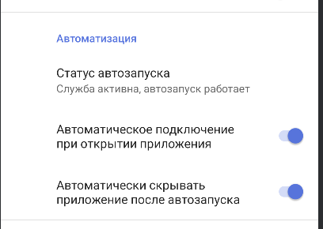

# ByeDPI for Android

  

---

Модификация ByeDPI Android с поддержкой фильтра приложений для режима VPN, автозапуска при старте устройства и автоподключением при запуске приложения.

Установить, включить в специальных возможностях. Активировать автозапуск и автоподключение в настройках.

Рекомендуется подключится один раз к vpn, чтобы принять запрос.

После этого, при загрузке устройства, приложение автоматически запустит сервис в зависимости от настроек (VPN/Proxy)

---

Приложение для Android, которое запускает локальный VPN-сервис для обхода DPI (Deep Packet Inspection) и цензуры.

Приложение локально запускает ByeDPI и перенаправляет весь TCP трафик через него.

Для обхода некоторых блокировок может потребоваться изменить настройки. Подробнее о различных настройках можно прочитать в [документации ByeDPI](https://github.com/hufrea/byedpi/blob/v0.13/README.md).

Приложение не является VPN. Оно использует VPN-режим на Android для перенаправления трафика, но не передает ничего на удаленный сервер. Оно не шифрует трафик и не скрывает ваш IP-адрес.
