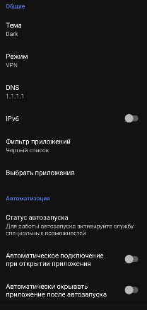
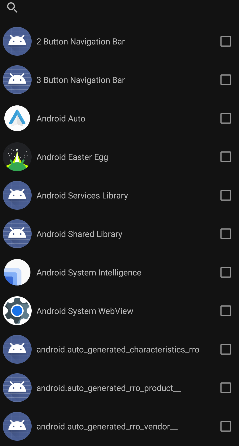

# ByeByeDPI Android

  

---

### Форк ByeDPI Android

* Поддержка фильтра приложений для режима VPN (рездельное туннелирование через whitelist/blacklist)
* Автозапуск VPN/Proxy при старте устройства
* Автоподключение к VPN/Proxy при запуске приложения
* Улучшена совместимость с Android TV/BOX, исправлены некоторые ошибки оригинала

    
    

### Использование
* Для работы автозапуска активируйте службу в специальных возможностях.
* Рекомендуется подключится один раз к vpn, чтобы принять запрос.
* После этого, при загрузке устройства, приложение автоматически запустит сервис в зависимости от настроек (VPN/Proxy)
* Если у вас Android TV/BOX, и при подключении пропадает соединение по Ethernet, активируйте режим белого списка и укажите нужные приложения, которые должны работать через VPN (например, YouTube)

---

Приложение для Android, которое запускает локальный VPN-сервис для обхода DPI (Deep Packet Inspection) и цензуры.

Приложение локально запускает ByeDPI и перенаправляет весь TCP трафик через него.

Для обхода некоторых блокировок может потребоваться изменить настройки. Подробнее о различных настройках можно прочитать в [документации ByeDPI](https://github.com/hufrea/byedpi/blob/v0.13/README.md).

Приложение не является VPN. Оно использует VPN-режим на Android для перенаправления трафика, но не передает ничего на удаленный сервер. Оно не шифрует трафик и не скрывает ваш IP-адрес.
